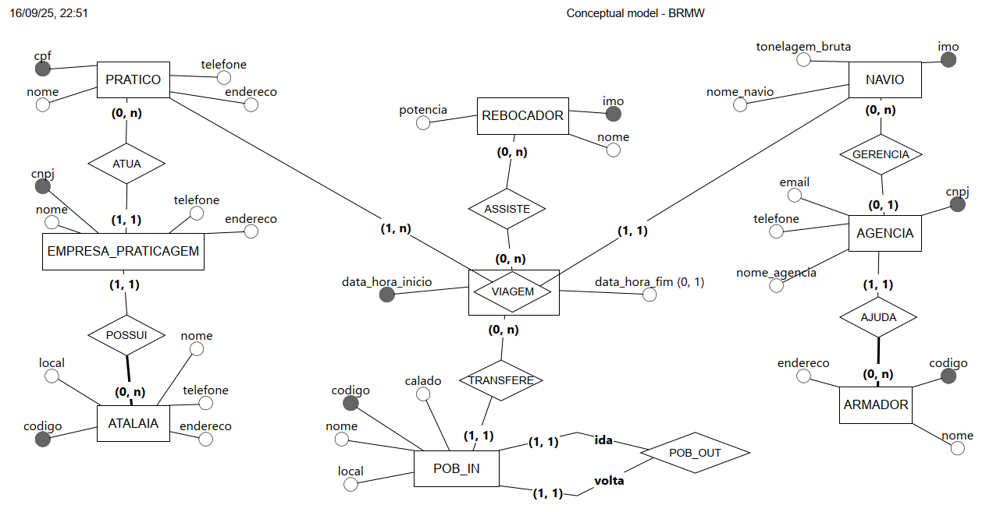

# Trabalo_modelagem_conceitual
Trabalho para o T1 de modelagem conceitual para a disciplina Bando de Dados 1

https://app.brmodeloweb.com/#!/publicview/68c6ac5c0aee1f3e65bbddc4

ZONA DE PRATICAGEM

Deseja-se controlar as viagens dos navios em uma Zona de Praticagem. 
Cada VIAGEM é atendida por pelo menos um PRATICO, admitindo-se a participação de mais de um profissional quando as condições exigirem. A VIAGEM possui exatamente um TERMINAL DE SAÍDA e um TERMINAL DE CHEGADA, estabelecendo a derrota da faina de praticagem na área portuária.
Existe mais de uma viagem entre os diversos pontos de saída e de chegada. 
O PRATICO é identificado pelo seu CPF, e deve guardar seu nome, seu endereço e seu telefone. O PRATICO atua nas VIAGENS ou manobras em navios. Um mesmo prático pode atuar em muitas viagens diferentes.
Os terminais possuem atributos como código, local, telefone e endereço.
O ARMADOR possui CNPJ, nome, endereço e telefone, representando a pessoa jurídica responsável pela propriedade ou operação econômica dos navios. 
Porém o vínculo entre o NAVIO e o ARMADOR passa necessariamente por um AGENCIA DE NAVEGAÇÃO. Um armador sem agência não pode fazer viagens. A agência representa o navio e uma agência pode possuir muitos navios, enquanto cada navio é representado por uma única agência, garantindo responsabilidade clara sobre a embarcação. A AGENCIA é registrada com CNPJ, nome, telefone de contato, e-mail e endereço, atuando como representante operacional do navio perante a praticagem e demais entes portuários. Uma AGENCIA solicita ou gerencia a VIAGEM de um NAVIO, podendo tratar muitas viagens ao longo do tempo, desde a requisição até a coordenação dos serviços envolvidos.
Cada VIAGEM deve ser diferente da outra. Ela é identificada pelo prático, pelos terminais de saída e de chagada, pela data/hora de início e pela data/hora de finalização. Ela está sempre associada a um único NAVIO e não pode haver viagem sem navio.
Cada NAVIO possui um número de identificação único chamado de IMO. Além disso, para cada navio também deve ser guardado o nome e a tonelagem bruta. Cada 
A EMPRESA DE PRATICAGEM possui CNPJ, com nome, endereço, telefone e e-mail, caracterizando a organização responsável pela prestação do serviço de praticagem. Ela pode conter vários práticos em seus quadros, mas deve ser permitido criar uma sem que haja práticos ainda envolvidos. O serviço de praticagem é efetivamente prestado pelas atalaias. Existe pelo menos uma atalaia ligada a empresa de praticagem, porém uma atalaia não pode existir sem que esteja ligada a uma determinada empresa de praticagem. Uma empresa de praticagem pode possuir mais de uma atalaia. A ATALAIA deve contar os atributos local, nome, telefone e endereço, centralizando a coordenação de tráfego, comunicações e despacho no âmbito da zona de praticagem.
Cada REBOCADOR possui o seu próprio número IMO, e para ele é necessário guardar o nome e a potência. O REBOCADOR assiste à viagem quando necessário e uma viagem pode receber assistência de zero ou mais rebocadores, de acordo com as condições de vento, corrente, calado e porte do navio. 
Os pontos de embarque e desembarque do prático são diversos e muito importantes para caracterização das viagens. O mesmo ponto de transferência pode ser um ponto de embarque ou um ponto de desembarque do prático a depender se o navio está de saída ou de chegada. Eles determinam o início e o final da faina de praticagem e devem possuir como atributos um código, calado, local e nome, servindo como referência operacional para a transferência do prático entre a lancha de praticagem e o navio  
Além de contar todos os atributos, entidades e relacionamentos necessários, o banco de dados deve possui as seguintes funcionalidades:
1.	As funcionalidades necessárias para o CRUD;
2.	Buscar as viagens realizadas por um determinado navio;
3.	Somar as tonelagens brutas dos navios que vieram para a zona de praticagem;
4.	Listar as viagens que um determinado prático atuou;
5.	Verificar as viagens onde o rebocador prestou assistência;
6.	Listar as atalaias que o prático está trabalhando;
7.	Fazer a estatísticas da frequência dos pontos de embarque e desembarque;

